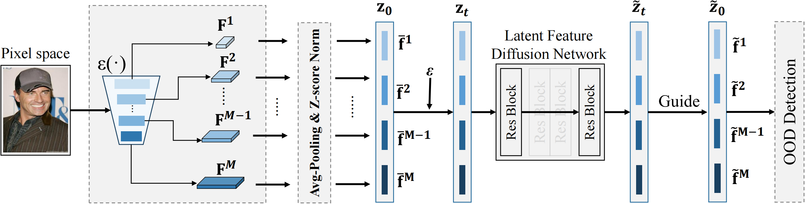

# Diffusion-based Multi-layer Semantic Reconstruction for Unsupervised Out-of-Distribution Detection
This is the official repo for 

[Diffusion-based Multi-layer Semantic Reconstruction for Unsupervised Out-of-Distribution Detection (NeurIPS 2024)](https://arxiv.org/abs/2411.10701)

by Ying Yang1∗, De Cheng1∗†, Chaowei Fang1∗†, Yubiao Wang, Changzhe Jiao, Lechao Cheng, Nannan Wang, Xinbo Gao



## Abstract

Unsupervised out-of-distribution (OOD) detection aims to identify out-of-domain data by learning only from unlabeled In-Distribution (ID) training samples, which is crucial for developing a safe real-world machine learning system. Current reconstruction-based method provides a good alternative approach, by measuring the reconstruction error between the input and its corresponding generative counterpart in the pixel/feature space. However, such generative methods face the key dilemma, $i.e.$, *improving the reconstruction power of the generative model, while keeping compact representation of the ID data.* To address this issue, we propose the diffusion-based layer-wise semantic reconstruction approach for unsupervised OOD detection. The innovation of our approach is that we leverage the diffusion model's intrinsic data reconstruction ability to distinguish ID samples from OOD samples in the latent feature space. Moreover, to set up a comprehensive and discriminative feature representation, we devise a multi-layer semantic feature extraction strategy. Through distorting the extracted features with Gaussian noises and applying the diffusion model for feature reconstruction, the separation of ID and OOD samples is implemented according to the reconstruction errors. Extensive experimental results on multiple benchmarks built upon various datasets demonstrate that our method achieves state-of-the-art performance in terms of detection accuracy and speed.

## Citation

@article{yang2024diffusion,
  title={Diffusion-based Layer-wise Semantic Reconstruction for Unsupervised Out-of-Distribution Detection},
  author={Yang, Ying and Cheng, De and Fang, Chaowei and Wang, Yubiao and Jiao, Changzhe and Cheng, Lechao and Wang, Nannan},
  journal={arXiv preprint arXiv:2411.10701},
  year={2024}
}

## Environment

To ensure compatibility and reproduce the results, please set up your environment using the provided `environment.txt` file.

### Steps to Set Up the Environment:

1. Make sure you have [conda](https://docs.conda.io/en/latest/miniconda.html) installed on your system.
2. Create a new environment and install the dependencies using the `environment.txt` file:
   ```sh
   conda create --name <your_environment_name> --file environment.txt
3. Activate the newly created environment:
   conda activate <your_environment_name>

## Usage

To train a model on datasets such as CIFAR10:

1. **Download the Pre-trained Checkpoint**:  
   Please download the `efficientnet-b4-6ed6700e.pth` file from [this link](your-pan-link-here) and place it in the current project directory.

2. **Run the Training Script**:
   You can start training by running the `main.py` script:
   ```bash
   python main.py --config config/Config.yaml --data_path ./data

3. **Multi-GPU Trainin**:
   If you wish to utilize multiple GPUs, you can use torchrun as follows:
   ```bash
   torchrun --nproc_per_node=<number_of_gpus> main.py --config config/Config.yaml --data_path ./data

   
